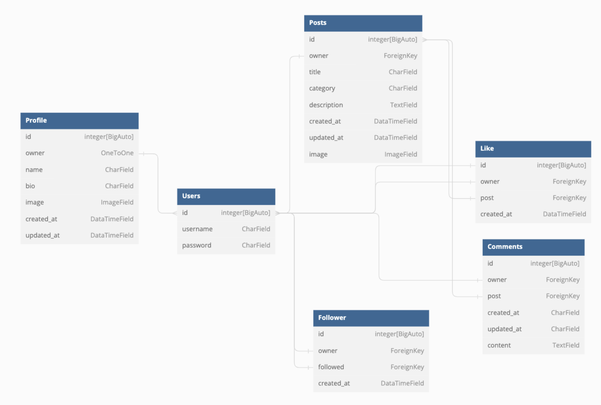

# Capture API in DRF 

Developer: Asma Aamir 

[Live Link](https://capture-api-drf.herokuapp.com/)

This repository has the Django REST Framework-based API created for the Capture front-end application. This link will take you to the [Live Website](....) and its [repository](....).

## Table of Contents
- [ User Stories](#user-stories)
- [ Database ](#datebase)
- [ Technologies](#tecnologies)
- [ Validation](#validations)
- [Testing](#testing)
- [Credits](#credits)

## User Stories

This is administrative part of the Capture project is the emphasis of the back-end of the project. As a result, there is just one user story.
- As an Admin, I want to be able create, edit and delete the user's posts, comments, and likes so that, I can regulate the user's content and eliminate any potentially offensive stuff.

## Database
I developed the following models for the application to provide structure to the database model:

Database Model

     

#### User Model
- 
- One-to-One relation with Profile model owner field
- ForeignKey realation with Post model owner field
- ForeignKey realation with Followee model owner and followed fields
- ForeignKey realation with Comment model owner field
- ForeignKey realation with Like model owner field

#### Profile Model
- The Profile model contains the following fields: Owner, name, bio, image, created_at and updated_at.
- The owner field and the User model id field have a one-to-one relationship.

#### Post Model
- The Post model contains the following fields: Owner, title, category, description, created_at, updated_at, Image and country_choices.
- ForeignKey realation with the Comment model post field
- ForeignKey realation with  the Like model post field

#### Like Model
- The Like model contains the following fields: Owner, post and created_at.
- Relationship between the User model field and foreign keys
- User model id field and owner field have a foreign key relationship.
- Post field and Post model post field have a foreign key relationship.

#### Comment Model 
- The Like model contains the following fields: Owner, post, content, created_at and updated_at.
- The owner field and User model id field have a foreign key relation.
- Between the post field and the user model post field, there is a ForeignKey relation.

#### Follower Model
- The Like model contains the following fields: Owner, followed and created_at.
- User model id field and owner field have a foreign key relationship.
- Between the followed field and the user model post field, there is a foreign key relation.

## Tecnologies

### Languages & Frameworks

The following languages and framework utilised for this repository:
- Python 
- Django 

### Labraries 

- Django 
- Pillow
- Django REST Framework

### Tools
 
- Git was used to upload the source code to GitHub. 
- GitHub was utilised as a remote repository to keep the code for the Capture project.
- Codeanywhere - It serves as a virtual IDE workspace for the Capture website.
- APITestCase - Using the Django Rest Framework, I conducted automated testing.
- Cloudinary was used to store static files 
- PostgreSQL was used to deployed this repository on Render using PostgreSQL database

## Validations

## Testing

I carried out two different type tests for the Capture_API_DRF:
1. Manual testing - of the user stories 
2. Automated testing  

Additionally, only users who are logged in can do these actions on posts or profiles. If a user wants to like, comment on, or follow something on the website, they must first log in.  

| ** Test ** | ** Action ** | ** Expected result ** | ** Actual Result ** |
| -----------| ------------ | --------------------- | ------------------- |
| User | Create user | user can be created | Works as expected|
| User/Admin | Permission |  Permission can be changed | Works as expected |
| Profile | Update & delete user | A profile can be created, edited and deleted | Works as expected |
| Post | Create, update & delete user | A post can be created, edited and deleted | Works as expected |
| Likes | Like & Unlike | Post can be liked and unliked | Work as expected| 
| Commets | Create, update & delete comments | User can  created, edited and deleted comment on post | Works as expected |
| Follow | Follow & Unfollow | User can follow and un follow profile | Work as expected|

Create User

     

Change Permissons

    

Profile

    

Change Profile

        

    

Delete Profile

        

Post

    

Create Post

        

    

Change Post

        

    

Delete Post

        

Like

    

Like

        

    

Unlike

        

Comment

  

Adding Comment

    

    

Removing comment

    

Follow

    

Following

        

    

Unfollow

        

## Credits
